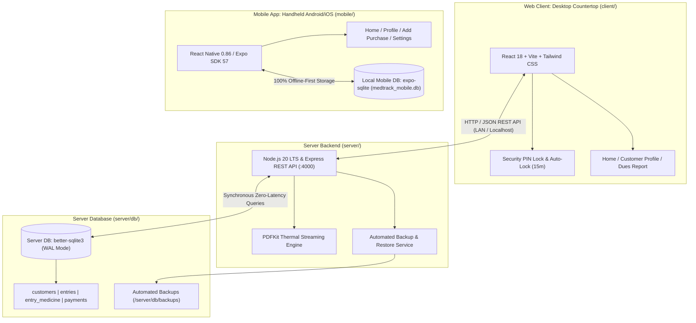
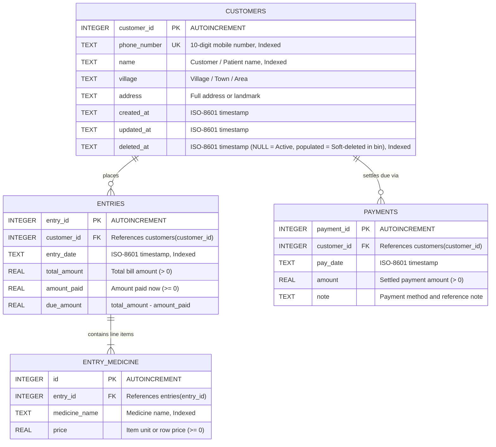
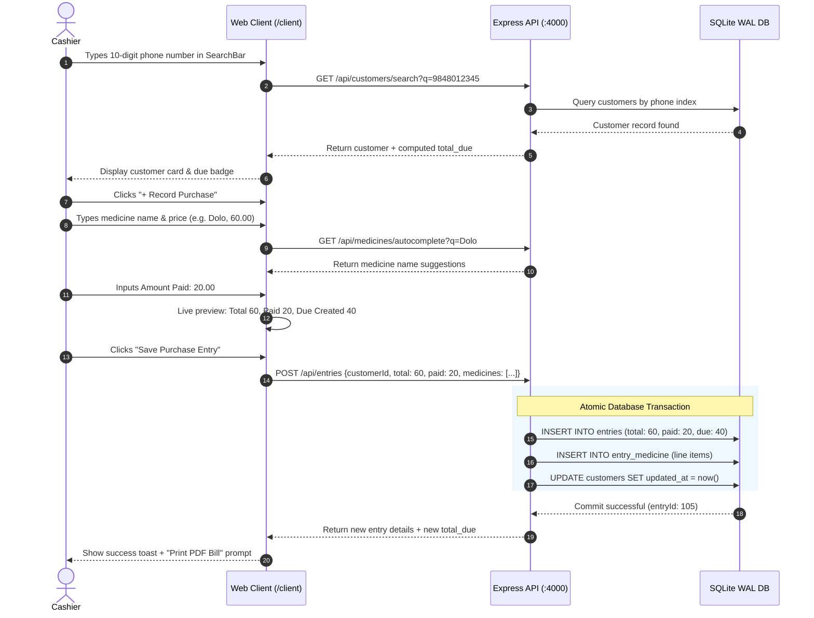
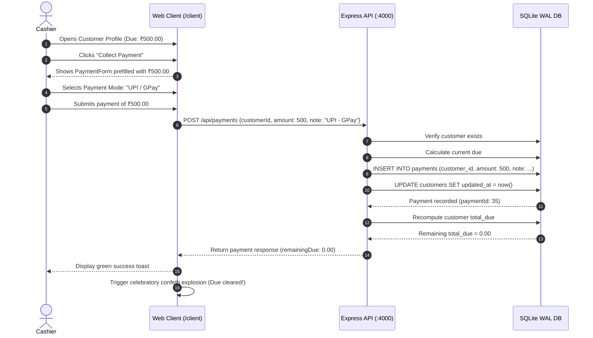

# MedTrack (Medcust) — Complete System Architecture & Technical Specifications

**Document Version:** 1.1.0  
**Last Updated:** October 2026  
**System Name:** MedTrack (Medical Shop Customer Khata Ledger)  
**Repository:** `Medcust`  
**Target Environment:** Pharmacy Countertop Terminals (Web) & Handheld Counter Devices (Android Mobile)

---

> [!WARNING]
> ### 🛡️ Critical Security & Network Architecture Notice
> - **Default Countertop PIN (`1234`):** The 4-digit PIN lock on the web client is designed strictly as a front-of-counter privacy lock to prevent retail customers and visitors from peeking at outstanding customer debts on the countertop monitor. It is **not** cryptographic authentication.
> - **Unauthenticated REST API:** The Express backend (`:4000`) currently executes without session cookies, Bearer JWTs, or role-based access control. All `/api/*` endpoints are open.
> - **Operational Boundary:** The system is engineered strictly for **`localhost`** or a **physically isolated pharmacy LAN** behind a trusted router firewall.
> - **Hardening Requirements (Before Leaving Local Network):**
>   1. Deploy behind a TLS/HTTPS reverse proxy (Nginx / Caddy / Cloudflare Tunnel).
>   2. Implement Bearer JWT middleware on all Express routes.
>   3. Enforce an immediate forced PIN change on initial setup.
>   4. Whitelist explicit CORS origins in `server.js` (disable wildcard `cors()`).
>   5. Implement rate limiting via `express-rate-limit` on search and payment endpoints.

---

## 1. Executive System Overview

**MedTrack** is a specialized digital khata (credit ledger) system engineered for high-speed retail pharmacy and medical shop operations. Counter operations demand extreme speed, zero accounting errors, and instant customer verification. MedTrack replaces fragile paper ledger notebooks with:

1. **Sub-2-Second Customer Phone Lookup:** Immediate retrieval of customer ledger history and credit balance via 10-digit mobile number indexing.
2. **Zero-Error Derived Dues Accounting:** Customer due balances are strictly computed on read from transaction entries rather than maintained as mutable columns:
   $$\text{Total Due} = \sum (\text{entries.due\_amount}) - \sum (\text{payments.amount})$$
3. **20-Second Purchase Entry:** Rapid multi-item medicine entry with real-time autocomplete suggestions derived from past store entries.
4. **Thermal Bill Generation:** Streaming A5 / 80mm thermal-ready PDF receipts for customer visits.
5. **Automated Multi-Tier Backups:** Daily boot snapshots, pre-restore backups, and 30-day snapshot rotation.

---

### High-Level System Architecture



> [!NOTE]
> **Complete Offline Separation:** The mobile application is **100% offline-first** and reads/writes exclusively to its local on-device SQLite database (`LocalDB`). It does **not** communicate directly with the server database. Handheld backups are shared via the native OS Share Sheet.

---

## 2. Database Architecture & Data Specifications

MedTrack utilizes a dual-database architecture:
- **Server Database:** SQLite via `better-sqlite3` in Write-Ahead Logging (`WAL`) mode for counter desktop cashier terminals.
- **Mobile Local Database:** SQLite via `expo-sqlite` on native mobile devices, with a development browser fallback (`localStorage`).

---

### 2.1. Server Database (`server/db/medtrack.sqlite`)

#### Engine Settings & PRAGMAs
```sql
PRAGMA journal_mode = WAL;
PRAGMA foreign_keys = ON;
PRAGMA synchronous = NORMAL;
```
- **WAL Mode (`Write-Ahead Logging`):** Permits concurrent reads without waiting for write transactions to finish, ensuring sub-millisecond counter queries.
- **Foreign Keys Enabled:** Ensures cascading referential integrity between customers, entries, line items, and payments.
- **Synchronous NORMAL:** Delivers high write throughput while maintaining database integrity across sudden power outages.

---

#### Entity Relationship Diagram (ERD)



---

#### DDL Schema Definition (`server/db/schema.sql`)

```sql
-- Customers master table
CREATE TABLE IF NOT EXISTS customers (
  customer_id INTEGER PRIMARY KEY AUTOINCREMENT,
  phone_number TEXT UNIQUE NOT NULL,
  name TEXT NOT NULL,
  village TEXT,
  address TEXT,
  created_at TEXT DEFAULT CURRENT_TIMESTAMP,
  updated_at TEXT DEFAULT CURRENT_TIMESTAMP,
  deleted_at TEXT DEFAULT NULL
);

-- Purchase entries (Header transactions)
CREATE TABLE IF NOT EXISTS entries (
  entry_id INTEGER PRIMARY KEY AUTOINCREMENT,
  customer_id INTEGER NOT NULL REFERENCES customers(customer_id),
  entry_date TEXT DEFAULT CURRENT_TIMESTAMP,
  total_amount REAL NOT NULL,
  amount_paid REAL NOT NULL,
  due_amount REAL NOT NULL
);

-- Individual medicine line items for each entry
CREATE TABLE IF NOT EXISTS entry_medicine (
  id INTEGER PRIMARY KEY AUTOINCREMENT,
  entry_id INTEGER NOT NULL REFERENCES entries(entry_id),
  medicine_name TEXT NOT NULL,
  price REAL NOT NULL DEFAULT 0
);

-- Customer due clearance payments
CREATE TABLE IF NOT EXISTS payments (
  payment_id INTEGER PRIMARY KEY AUTOINCREMENT,
  customer_id INTEGER NOT NULL REFERENCES customers(customer_id),
  pay_date TEXT DEFAULT CURRENT_TIMESTAMP,
  amount REAL NOT NULL,
  note TEXT
);

-- Strategic Indexes for Sub-2-Second Counter Searches
CREATE INDEX IF NOT EXISTS idx_customers_phone ON customers(phone_number);
CREATE INDEX IF NOT EXISTS idx_customers_name ON customers(name);
CREATE INDEX IF NOT EXISTS idx_customers_deleted ON customers(deleted_at);
CREATE INDEX IF NOT EXISTS idx_entries_customer ON entries(customer_id);
CREATE INDEX IF NOT EXISTS idx_entries_date ON entries(entry_date);
CREATE INDEX IF NOT EXISTS idx_payments_customer ON payments(customer_id);
CREATE INDEX IF NOT EXISTS idx_entry_medicine_entry ON entry_medicine(entry_id);
CREATE INDEX IF NOT EXISTS idx_entry_medicine_name ON entry_medicine(medicine_name);
```

> [!NOTE]
> **Foreign Key Cascade Policy:**  
> In the server schema (`schema.sql`), foreign keys are defined as `REFERENCES entries(entry_id)` without an `ON DELETE CASCADE` clause. This is deliberate: customer deletion is a soft-delete (`deleted_at = CURRENT_TIMESTAMP`), ensuring purchase entries and payments stay untouched as immutable financial history. In the rare case of permanent deletion from the Recycle Bin, both the server (`permanentDeleteCustomer`) and mobile client execute explicit cascade deletion in ONE atomic database transaction in the strict dependency order: `entry_medicine` -> `entries` -> `payments` -> `customers`.

---

### 2.2. Zero-Error Dues Derivation Logic

In conventional accounting software, customer due balances are frequently stored in an editable column (`balance`). Under real-world pharmacy counter conditions (power cuts, network disconnects, concurrent cashiers), stored balances frequently drift from actual transaction sums.

In **MedTrack**, balance is **strictly derived**:

```sql
SELECT
  ROUND(
    COALESCE(SUM(e.due_amount), 0) - (
      SELECT COALESCE(SUM(p.amount), 0)
      FROM payments p
      WHERE p.customer_id = ?
    ), 
    2
  ) AS total_due
FROM entries e
WHERE e.customer_id = ?;
```

#### Core Financial Principles:
1. `due_amount` on each entry is computed strictly as:
   $$\text{due\_amount} = \text{total\_amount} - \text{amount\_paid}$$
2. The running outstanding due for any customer $C$ across all time is:
   $$\text{Total Due}(C) = \max\left(0, \sum_{e \in \text{Entries}(C)} e.\text{due\_amount} - \sum_{p \in \text{Payments}(C)} p.\text{amount}\right)$$
3. If a customer overpays, the application rejects the payment unless the cashier explicitly confirms the overage (`allowOverpayment: true`).

#### Dues Clamping Discrepancy (Server vs. Mobile)
There is an architectural divergence between the server backend and the mobile client regarding customer credit balances:
- **Server Backend (`getCustomerDue`):** Clamps the calculated due to $\ge 0$ using `Math.max(0, row.total_due || 0)`. The server treats overpayments as an edge case, safeguarding against displaying negative dues on receipts and reports. Overpayments are not retained as a store credit balance.
- **Mobile Client (`calculateCustomerTotalDue`):** Does **not** clamp to 0 (`parseFloat(sum.toFixed(2))`). A customer with higher payments than purchase dues displays a negative balance (`-₹X.XX`), surfaced in the UI as **`₹X in credit`**. The mobile client actively enforces this credit balance by prohibiting customer deletion while credit exists (`if (currentDue < -0.001) Alert.alert('Cannot Delete Customer', ... currently in credit)`).
- **Target Reconciliation:** The server should be updated to return both `total_due: Math.max(0, net)` and `credit_balance: Math.max(0, -net)` so that customer store credits are first-class financial entities across both platforms.

---

### 2.3. Mobile Local SQLite Schema (`mobile/src/db/database.js`)

The standalone React Native / Expo application operates independently using on-device SQLite (`medtrack_mobile.db`):

```sql
CREATE TABLE IF NOT EXISTS customers (
  customer_id INTEGER PRIMARY KEY AUTOINCREMENT,
  phone_number TEXT UNIQUE NOT NULL,
  name TEXT NOT NULL,
  village TEXT,
  address TEXT,
  created_at TEXT DEFAULT CURRENT_TIMESTAMP,
  deleted_at TEXT DEFAULT NULL
);

CREATE TABLE IF NOT EXISTS entries (
  entry_id INTEGER PRIMARY KEY AUTOINCREMENT,
  customer_id INTEGER NOT NULL REFERENCES customers(customer_id),
  entry_date TEXT DEFAULT CURRENT_TIMESTAMP,
  total_amount REAL NOT NULL DEFAULT 0,
  amount_paid REAL NOT NULL DEFAULT 0,
  due_amount REAL NOT NULL DEFAULT 0
);

CREATE TABLE IF NOT EXISTS entry_medicines (
  id INTEGER PRIMARY KEY AUTOINCREMENT,
  entry_id INTEGER NOT NULL REFERENCES entries(entry_id),
  medicine_name TEXT NOT NULL,
  price REAL DEFAULT 0,
  discount REAL DEFAULT 0
);

CREATE TABLE IF NOT EXISTS shop_profile (
  id INTEGER PRIMARY KEY CHECK (id = 1),
  shop_name TEXT DEFAULT '',
  shop_license_no TEXT DEFAULT '',
  shop_license_validity TEXT DEFAULT '',
  shop_phone TEXT DEFAULT '',
  pharmacist_name TEXT DEFAULT '',
  pharmacist_phone TEXT DEFAULT '',
  pharmacist_license_validity TEXT DEFAULT '',
  updated_at TEXT DEFAULT CURRENT_TIMESTAMP
);

CREATE INDEX IF NOT EXISTS idx_customers_phone ON customers(phone_number);
CREATE INDEX IF NOT EXISTS idx_customers_deleted ON customers(deleted_at);
```

#### Mobile Schema Enhancements & Dual Driver:
- **`discount` Column:** Supported per medicine row to compute post-discount line totals:
  $$\text{Line Total} = \max(0, \text{price} - \max(0, \text{discount}))$$
- **`shop_profile` Table:** Stores pharmacy license, validity, and pharmacist credentials locally for receipt headers.
- **Native vs Web Driver:**
  - **Native Production Driver (`Platform.OS !== 'web'`):** Uses `expo-sqlite` opening `medtrack_mobile.db` on Android/iOS.
  - **Web Development Fallback (`Platform.OS === 'web'`):** Shims data operations to browser `localStorage` (`medtrack_web_db_v1`) to facilitate rapid UI layout prototyping without requiring a running emulator or physical phone.
- **Data Quality Sanitization:** Automatically purges junk test strings (e.g. `"test"`, `"asdf"`, `"yu"`) from autocomplete suggestion indices.

#### Schema & Field Naming Divergence Matrix

| Architectural Feature | Server (`server/db/schema.sql`) | Mobile (`mobile/src/db/database.js`) | Impact & Reconciliation |
|---|---|---|---|
| **Medicine Table Name** | `entry_medicine` (singular) | `entry_medicines` (plural) | Direct query divergence; requires mapping layer for cross-sync |
| **Line-Item Discounts** | Not supported (stores pure `price`) | Supported (`discount REAL DEFAULT 0`) | Server cannot persist or compute individual item discounts |
| **Customer Timestamps** | Tracks `created_at` and `updated_at` | Only tracks `created_at` | Mobile cannot track customer profile update timestamps |
| **Soft Deletion (`deleted_at`)** | Supported (`TEXT DEFAULT NULL`) | Supported (`TEXT DEFAULT NULL`) | Consistent soft-deletion and Recycle Bin lifecycle across both platforms |
| **Shop Compliance Schema**| Config-driven (`config.js`) | SQLite table (`shop_profile`) | Server config uses env vars; mobile persists in database |
| **API Parameter Aliasing**| Accepts snake_case & camelCase | Native camelCase JS calls | Server route handlers normalize `customerId` / `customer_id` |

---

### 2.4. Comprehensive Backup & Disaster Recovery Architecture

The backup subsystem in [`server/services/backupService.js`](./server/services/backupService.js) implements a 5-tier safety model:

1. **Automated Daily Startup Backup:**  
   Every time `server.js` boots, it invokes `performBackup(false)`. If a snapshot for the current date (`medtrack_backup_YYYY-MM-DD.sqlite`) already exists in `server/db/backups/`, it skips creation (`skipped: true`). If none exists, a daily snapshot is automatically created.
2. **On-Demand Manual Snapshot:**  
   Cashiers can click "Create Backup" in the web header or trigger `POST /api/reports/backup`, creating a timestamped snapshot: `medtrack_backup_YYYY-MM-DD_<timestamp>.sqlite`.
3. **Pre-Restore Safety Snapshot:**  
   Prior to restoring any historical backup over the live database, the server automatically captures a safety snapshot: `medtrack_pre_restore_<timestamp>.sqlite`.
4. **Pre-Permanent-Delete & Auto-Purge Safety Snapshot:**  
   Prior to executing permanent customer eradication (`DELETE /api/customers/:id/permanent`) or auto-purging 30-day expired bin items, the system invokes `performBackup(true)` to capture an immediate safety snapshot, ensuring that permanently purged records remain fully recoverable from SQLite archive snapshots if requested.
5. **30-Day Retention & Pruning Rotation:**  
   After every snapshot creation, `cleanupOldBackups(30)` executes. It sorts all `.sqlite` files in `server/db/backups/` by modification date, preserves the 30 newest files, and unlinks older files to prevent disk saturation.
6. **WAL Checkpoint Flushes:**  
   Before any `.sqlite` physical copy is made, the service executes `db.pragma('wal_checkpoint(TRUNCATE)')` to ensure all pending transaction log frames are fully merged into the primary file.
7. **Data Exports:**  
   - Binary SQLite file download via `GET /api/reports/export/sqlite`.
   - Comprehensive multi-table CSV spreadsheet export via `GET /api/reports/export/csv`.

---

## 3. Backend Architecture & REST API Specifications

The server runs on **Node.js 20 LTS** (minimum Node 18.18+) with **Express.js**, communicating synchronously with SQLite via `better-sqlite3`.

### 3.1. Server Architecture & Directory Structure

```
server/
├── config.js                 # Central configuration (Ports, Paths, Shop Meta)
├── server.js                 # HTTP listener & middleware bootstrap
├── db/
│   ├── database.js           # better-sqlite3 connection & transaction methods
│   ├── schema.sql            # Master DDL schema definition
│   ├── seed.js               # Sample data generator for development/testing
│   ├── medtrack.sqlite       # Primary SQLite database file
│   └── backups/              # Automated & manual snapshot archive
├── routes/
│   ├── customers.js          # Customer search, profile, & registration
│   ├── entries.js            # Multi-line purchase entry recording
│   ├── payments.js           # Due clearance settlements
│   ├── medicines.js          # Real-time medicine autocomplete
│   ├── reports.js            # Dues ledger, store stats, & backup management
│   └── bills.js              # Streaming A5/thermal PDF receipts
├── services/
│   ├── backupService.js      # Snapshot, restore, & CSV generation
│   └── pdfService.js         # PDFKit thermal bill builder
└── package.json
```

### 3.2. Server Configuration (`server/config.js`)

All store branding parameters support override via environment variables (or `.env` file):

| Config Key | Env Variable Override | Default Value (Placeholder) | Description |
|---|---|---|---|
| `PORT` | `PORT` | `4000` | Port for the Express REST API |
| `DB_PATH` | — | `server/db/medtrack.sqlite` | SQLite database file location |
| `BACKUP_DIR` | — | `server/db/backups` | Storage directory for database snapshot files |
| `SHOP.name` | `SHOP_NAME` | `"MedTrack Medical & General Store"` | *(Placeholder)* Medical store trade name |
| `SHOP.tagline` | `SHOP_TAGLINE` | `"Trusted Care & Healthcare Essentials"` | *(Placeholder)* Subtitle printed on receipts |
| `SHOP.address` | `SHOP_ADDRESS` | `"Main Road, Opp. Primary Health Center"` | *(Placeholder)* Physical store address |
| `SHOP.city` | `SHOP_CITY` | `"Nizampet, Hyderabad"` | *(Placeholder)* City & postal area |
| `SHOP.phone` | `SHOP_PHONE` | `"+91 98765 43210"` | *(Placeholder)* Store contact phone number |
| `SHOP.dlNo` | `SHOP_DL` | `"DL-20B/21B-54892"` | *(Placeholder)* Pharmacy Drug License Number |
| `SHOP.gstin` | `SHOP_GST` | `"36AABCM1234F1Z8"` | *(Placeholder)* Store GSTIN tax identifier |
| `TRASH_RETENTION_DAYS` | `TRASH_RETENTION_DAYS` | `30` | Auto-purge retention window (days) for soft-deleted customers |

> [!TIP]
> **Store Customization:** The default values above are sample placeholders. Production deployments should configure actual pharmacy credentials in a `.env` file at the `server/` root.

---

### 3.3. REST API Endpoint Reference

#### Complete Routes Summary Table

| Method | Endpoint | Description |
|---|---|---|
| `GET` | `/api/customers/search?q={query}` | Phone-first customer search (< 2s) with name/village fallback (active customers only) |
| `GET` | `/api/customers/trash` | List all soft-deleted customers currently in the Recycle Bin |
| `GET` | `/api/customers/:id` | Full customer profile with derived dues, lifetime spend, visits (404 if soft-deleted) |
| `GET` | `/api/customers/:id/stats` | Aggregated visit count, spend, and top 5 recently bought medicines |
| `POST` | `/api/customers` | Register new customer; returns 409 `{ inRecycleBin: true }` if phone is binned |
| `DELETE` | `/api/customers/:id` | Soft delete customer (`deleted_at = CURRENT_TIMESTAMP`); blocked with 409 if due != 0 |
| `POST` | `/api/customers/:id/restore` | Restore soft-deleted customer from Recycle Bin back to active ledger |
| `DELETE` | `/api/customers/:id/permanent` | Permanently erase customer & all history in 1 tx with pre-backup; requires `{ confirm: "DELETE" }` |
| `POST` | `/api/entries` | Atomically record multi-item purchase visit and calculate due |
| `GET` | `/api/entries?customer_id={id}` | Paginated list of customer purchase visits with line items |
| `GET` | `/api/entries/:id` | Detailed view of a single purchase entry |
| `POST` | `/api/payments` | Record due clearance payment with overpayment safeguard |
| `GET` | `/api/payments?customer_id={id}` | Retrieve payment history log for customer or entire store |
| `GET` | `/api/medicines/autocomplete?q={q}` | Autocomplete suggestions from past entered medicines |
| `GET` | `/api/reports/dues` | Store-wide debtors list with village breakdown and sorting (active customers only) |
| `GET` | `/api/reports/stats` | Monthly sales, collections, active debtor count, top medicines |
| `POST` | `/api/reports/backup` | Trigger immediate on-demand database backup snapshot |
| `GET` | `/api/reports/backups` | List all existing database backup files with sizes and dates |
| `POST` | `/api/reports/restore` | Restore database from an existing snapshot with confirmation |
| `GET` | `/api/reports/export/sqlite` | Binary download of active `medtrack.sqlite` file |
| `GET` | `/api/reports/export/csv` | Download complete store ledger as CSV spreadsheet |
| `GET` | `/api/bills/:id` | **Stream thermal-ready A5 PDF receipt** for purchase entry |
| `GET` | `/api/config` | Returns shop branding, license info, and system timestamp |
| `GET` | `/api/health` | Healthcheck endpoint (`status: ok`) |

> [!NOTE]
> **Route Registration Precedence:** In Express, `GET /api/customers/trash` is registered **before** `GET /api/customers/:id` to prevent the parameterized route from capturing literal `"trash"` as a customer ID.

---

#### Endpoint Payloads & Responses

##### 1. Customer Search (`GET /api/customers/search?q=...`)
- **Query Parameter:** `q` (mobile number, customer name, or village).
- **Response `200 OK`:**
```json
[
  {
    "customer_id": 1,
    "phone_number": "9848012345",
    "name": "Ramesh Kumar",
    "village": "Rampur",
    "address": "Near Hanuman Temple",
    "created_at": "2026-09-15 10:30:00",
    "updated_at": "2026-09-20 18:45:00",
    "total_due": 340.00
  }
]
```

##### 2. Record Purchase Entry (`POST /api/entries`)
- **Payload:**
```json
{
  "customer_id": 1,
  "total_amount": 450.00,
  "amount_paid": 200.00,
  "entry_date": "2026-09-22T11:00:00Z",
  "medicines": [
    { "name": "Pantocid 40mg", "price": 180.00 },
    { "name": "Augmentin 625 Duo", "price": 270.00 }
  ]
}
```
- **Validation:** `total_amount > 0`, `0 <= amount_paid <= total_amount`, $\ge 1$ medicine item.
- **Response `201 Created`:** Returns `entryId`, customer metadata, line items, and updated `totalDue: 590.00`.

##### 3. Settle Due (`POST /api/payments`)
- **Payload:**
```json
{
  "customer_id": 1,
  "amount": 250.00,
  "note": "UPI - GPay Ref #9812",
  "allowOverpayment": false
}
```
- **Validation:** If `amount > currentDue` and `allowOverpayment === false`, returns `400 Bad Request` with `exceedsDue: true` and overage calculation.

##### 4. PDF Thermal Bill Streaming (`GET /api/bills/:id`)
- **Response:** Streams `application/pdf` inline (`Content-Disposition: inline; filename=bill_42.pdf`).
- **Layout:** Formatted for A5 / 80mm thermal receipt printers with store branding, GSTIN, Drug License number, customer metadata, medicine line items, visit due, and updated ledger balance.

##### 5. Recycle Bin & Soft Deletion Lifecycle

###### A. Soft Delete (`DELETE /api/customers/:id`)
- **Semantics:** Sets `customers.deleted_at = CURRENT_TIMESTAMP`. Line items in `entry_medicine`, purchase `entries`, and `payments` remain untouched in the database.
- **Accounting Guardrail (Rule 2):** Deletion is strictly blocked with `HTTP 409 Conflict` if the customer's derived balance is not zero (positive outstanding dues or credit overpayments).
- **Error Response `409 Conflict`:**
  ```json
  {
    "error": "Cannot delete customer with outstanding dues of ₹300.00. Balance must be ₹0.00 before deletion.",
    "due": 300.00,
    "balance": 300.00
  }
  ```

###### B. Visibility & Active Query Filtering (Rule 3)
- Soft-deleted customers are automatically hidden (`deleted_at IS NULL`) from:
  1. Phone/Name search (`GET /api/customers/search`)
  2. Direct profile lookup (`GET /api/customers/:id` returns `404 Not Found`)
  3. Store dues report / debtors list (`GET /api/reports/dues`)
  4. Active debtor count metrics in store stats (`GET /api/reports/stats`)
- **Historical Reporting Integrity:** Sales totals, daily collection aggregates, and medicine frequency calculations continue to include past transactions from soft-deleted customers.

###### C. Recycle Bin Inspection & Restoration (Rules 4 & 6)
- **Recycle Bin Listing (`GET /api/customers/trash`):** Returns all soft-deleted customer records ordered by `deleted_at DESC`.
- **Customer Restoration (`POST /api/customers/:id/restore`):** Sets `deleted_at = NULL` and returns the restored customer object with their derived due balance intact.
- **Phone Uniqueness & Re-registration Safeguard:** Customer phone numbers remain strictly reserved (`UNIQUE`). Registering a new customer with a binned customer's number (`POST /api/customers`) returns `409 Conflict` with:
  ```json
  {
    "error": "This phone number belongs to a customer in the Recycle Bin.",
    "inRecycleBin": true,
    "customer": {
      "customer_id": 5,
      "phone_number": "9000000005",
      "name": "Arun Kumar",
      "village": "Rampur"
    }
  }
  ```
  The UI uses this payload to present an immediate "Restore instead" action.

###### D. Permanent Eradication (Rules 5 & 7)
- **Permanent Delete (`DELETE /api/customers/:id/permanent`):**
  - Requires customer to already be in the Recycle Bin (`deleted_at IS NOT NULL`).
  - Requires request body: `{ "confirm": "DELETE" }`.
  - Automatically takes a pre-deletion backup snapshot (`performBackup(true)`).
  - In **ONE atomic database transaction**, executes cascading deletion in order:
    $$\text{entry\_medicine} \longrightarrow \text{entries} \longrightarrow \text{payments} \longrightarrow \text{customers}$$
- **Startup Auto-Purge:**
  - On every server boot, `autoPurgeTrash(config.TRASH_RETENTION_DAYS)` scans for soft-deleted customers older than 30 days (`deleted_at <= datetime('now', '-30 days')`).
  - Takes an automated pre-purge safety backup, then cascades deletion inside a single transaction.

---

## 4. User Interface (UI) Architecture & Frontend Details

MedTrack provides two targeted client experiences:
1. **Desktop Countertop Client (`/client`)**: React 18, Vite, and Tailwind CSS designed for counter cashiers with high-speed keyboard shortcuts and desktop monitors.
2. **Mobile Counter Application (`/mobile`)**: React Native (Expo) designed for pharmacists moving around store aisles or checking khata ledgers on Android phones.

---

### 4.1. Desktop Web Application (`client/`)

#### Design System & Aesthetic Tokens
- **Color Palette:**
  - Base Background: `bg-slate-50` with crisp card surfaces (`bg-white` + `border-slate-200/80`).
  - Brand Accent: `Indigo-600` (`#4f46e5`) for brand banners, primary buttons, and active tabs.
  - Zero Due Status ("All Clear"): `Emerald-50` background with `Emerald-700` badge.
  - Active Due Status ("Due Alert"): `Amber-50` background with `Amber-800` badge.
- **Typography:** System font stack (Inter/Segoe UI) optimized for fast readability under counter lighting; monospace fonts (`font-mono`) for phone numbers and financial amounts.
- **Micro-Animations & Delighters:** Subtle hover transitions and celebratory canvas confetti when customer dues drop to ₹0.

---

#### UI Component Hierarchy

```
App.jsx (Root View State, Inactivity Timer, Toast Context)
├── Header.jsx (Brand Banner, Search Toggle, Dues Report Link, Backup Modal Trigger, Lock Button)
├── PinLockModal.jsx (4-Digit PIN Security Gate, Inactivity Auto-Lock, PIN Change Dialog)
├── Toast.jsx (Toast Provider & Notification Stack)
│
├── Home.jsx (Landing View)
│   ├── SearchBar.jsx (Phone-Number-First Search, Debounced Querying, Add Customer Overlay Trigger)
│   ├── Modal.jsx -> Add Customer Form (10-Digit Mobile, Name, Village, Address)
│   └── Feature Highlights Cards (Phone-First, Zero-Error Dues, 20-Second Purchases)
│
├── CustomerProfile.jsx (Customer Khata Ledger View)
│   ├── CustomerCard.jsx (Customer Master Info, DuesBadge, Lifetime Spend, Visit Count)
│   ├── Action Buttons (+ Record Purchase, Collect Payment)
│   ├── Tab Bar ("Purchase History", "Recently Bought Medicines", "Payment History")
│   ├── Tab 1: EntryList.jsx (Visit Cards, Medicine Badges, Direct Print Bill PDF Button)
│   ├── Tab 2: Recently Bought (Top 5 Medicines, Frequency Counter, "X days ago" Badges)
│   ├── Tab 3: Payment History (Date, Settle Amount, Payment Mode & Note)
│   ├── EntryForm.jsx (Modal: Multi-Row Medicine Rows, Autocomplete Dropdown, Live Due Banner)
│   └── PaymentForm.jsx (Modal: Payment Amount, Cash/UPI/Bank Selector, Overpayment Guard)
│
├── DuesReport.jsx (Store-Wide Debtors View)
│   ├── Monthly Performance Bar (Sales, Collections, Total Outstanding, Debtor Count, Top Meds)
│   ├── Village Breakdown Chips
│   ├── Filter & Sort Toolbar (Sort by Amount/Village/Name, Village Dropdown)
│   ├── Debtors Table (Customer, Contact, Village, Last Activity, Due Badge, Direct Navigation)
│   └── CSV Export Action Button
├── BackupModal.jsx (Database Recovery Center)
│   ├── Immediate Backup Trigger
│   ├── Snapshot Archive Table (Filename, Size, Timestamp)
│   ├── Database Restoration Dialog (Safety Confirmation with "RESTORE")
│   └── Direct SQLite & CSV Download Buttons
│
└── RecycleBinModal.jsx (Customer Recycle Bin Center)
    ├── Soft-Deleted Debtors Table (Name, Phone, Village, Deleted Relative Timestamp)
    ├── Restore Customer Action (Instant ledger reactivate)
    └── Permanent Delete Dialog (Mandatory "DELETE" Text Confirmation + Shop PIN Safeguard)
```

---

#### Key Desktop UI Screens & Workflows

##### 1. Countertop Security PIN Lock (`PinLockModal.jsx`)
- Prevents counter customers from viewing outstanding debts or sales numbers.
- Interactive numeric keypad (0–9), keyboard event listeners, and masked digit dots.
- **Inactivity Auto-Lock:** Monitors user activity (`mousemove`, `keydown`, `touchstart`). If idle for 15 minutes, locks automatically.
- Default factory PIN: `1234`. Can be updated directly from the modal.

##### 2. Phone-First Search (`SearchBar.jsx`)
- **Keyboard Shortcut (`/`):** Pressing `/` anywhere on the screen auto-focuses the search bar.
- Automatic non-digit stripping (`replace(/\D/g, '')`).
- Sub-2-second response displaying name, phone, village, and current due badge.
- If no match is found, an instant `+ Add "{query}" as New Customer` overlay pre-fills the registration modal with the typed digits.

##### 3. 20-Second Purchase Billing Modal (`EntryForm.jsx`)
- Dynamic medicine rows with Enter key navigation.
- **Autocomplete Suggestions:** Typing $\ge 2$ characters queries previously entered medicines.
- Auto-summed total bill amount with manual total override option.
- **Live Due Calculation Banner:**
  - Full Payment: Displays green `"Bill fully settled. ₹0 due created."`
  - Partial Payment: Displays amber `"₹X Due will be recorded in customer ledger."`
- **Post-Entry Action:** Shows direct "Print PDF Bill" action button immediately upon saving.

##### 4. Payment Collection Modal (`PaymentForm.jsx`)
- Pre-fills with the customer's exact current due balance.
- Payment method selector: **Cash**, **UPI / GPay**, **Bank Transfer**.
- **Overpayment Guard:** Warns if entered amount exceeds due and disables submission until explicit confirmation is checked.

##### 5. Dues Report & Village Ledger (`DuesReport.jsx`)
- Displays store-wide accounts receivable ledger.
- Monthly metrics: Sales this Month, Cash Collected, Total Outstanding Dues, Active Debtors.
- Village chips for 1-click filtering (e.g. view only debtors in "Rampur").
- Sortable table columns (Amount, Village, Name).
- Direct CSV export downloads the filtered report to an Excel spreadsheet.

---

### 4.2. Mobile Counter Application (`mobile/`)

Built with **React Native** and **Expo**, the mobile app provides an on-device experience for inventory checks and khata inquiries.

#### Mobile Directory Structure

```
mobile/
├── App.js                     # Root navigation & database initialization
├── app.json                   # Expo application manifest
├── package.json
└── src/
    ├── constants/
    │   └── theme.js           # Theme tokens (Colors, Spacing, Typography)
    ├── db/
    │   └── database.js        # Expo SQLite native engine & Web localStorage fallback
    ├── screens/
    │   ├── HomeScreen.js             # Customer search & dues list
    │   ├── AddCustomerScreen.js      # Customer onboarding screen (binned restore prompt)
    │   ├── CustomerProfileScreen.js  # Ledger history, payment collection & soft-delete
    │   ├── AddPurchaseScreen.js      # Multi-item purchase entry with discounts
    │   ├── SettingsScreen.js         # Pharmacy compliance & Recycle Bin link
    │   └── RecycleBinScreen.js       # Soft-deleted customers, restore & permanent purge
    ├── services/
    │   └── exportService.js   # JSON ledger packaging & Native Share Sheet
    └── utils/
        ├── dateUtils.js       # ISO-8601 formatting & relative dates
        └── khataLogic.js      # Pure accounting functions & medicine validation
```

#### Dual Driver: Production Target vs Development Preview

| Mode | Environment | Driver | Persistence Engine | Intended Usage |
|---|---|---|---|---|
| **Production Target** | Android / iOS Device | `NATIVE_EXPO_SQLITE` | On-device SQLite file (`medtrack_mobile.db`) | Counter handheld tablets, mobile khata checking, 100% offline |
| **Development Preview** | Desktop Browser (`w` key) | `WEB_FALLBACK` | Browser `localStorage` (`medtrack_web_db_v1`) | Rapid UI prototyping and screen styling without an emulator |

#### Mobile Screens & Features

##### 1. Home Screen (`HomeScreen.js`)
- Sticky search bar at the top supporting name or mobile number lookups.
- Customer cards display name, village, last transaction date, and color-coded due badge.
- Floating Action Button (FAB) `+` navigates to `AddCustomerScreen`.
- Top header includes a direct **Share Backup** button that compiles all records into JSON and opens the native OS Share Sheet (WhatsApp, Google Drive, Email).

##### 2. Customer Profile Screen (`CustomerProfileScreen.js`)
- Displays customer contact details, total due balance, and lifetime entry count.
- Unified Ledger: Combines purchase visits and payment settlements in reverse-chronological order.
- Expandable line items displaying medicines, unit prices, and discounts.
- **Delete Customer Guard:** Prohibits customer deletion if an active due ($> 0$) or credit balance ($< 0$) exists.

##### 3. Add Purchase Screen (`AddPurchaseScreen.js`)
- Touch-optimized medicine rows with **Name**, **Unit Price**, and **Discount (₹)**.
- Autocomplete pill carousel proposing previously entered medicines from local storage.
- Live net total and due calculation banner.

##### 4. Store & Pharmacist Settings (`SettingsScreen.js`)
- Stores statutory compliance details:
  - Pharmacy Name, Phone Number.
  - Drug License Number & Validity Date.
  - Registered Pharmacist Name, Phone Number, & Registration Validity.
- Persisted locally in the `shop_profile` SQLite table.

---

## 5. End-to-End System Workflows

### 5.1. Customer Purchase & Credit Entry Workflow



---

### 5.2. Due Clearance & Payment Settlement Workflow



---

## 6. System Verification, Testing & Data Integrity

The backend test suite (`server/tests/`) validates financial integrity and error boundaries:
- **Transaction Atomicity:** Proves that an error during line item insertion rolls back the purchase header entry.
- **Accounting Validation:** Rejects negative total amounts, zero amounts, or payments exceeding due balances.
- **Phone Deduplication:** Proves that registering an identical phone number returns `409 Conflict` with the existing customer record.
- **Strict Derivation Testing:** Proves that updating entries or recording payments accurately recalculates `total_due` without balance drift.

Run backend tests via:
```bash
cd server
npm test
```

---

## 7. Setup & Operational Runbook

### 7.1. Prerequisites
- **Node.js:** Node 20 LTS (Recommended: `>= 20.10.0` for native `node --watch` support, Vite 6 bundling, and Expo SDK 57 Metro compilation; Minimum floor: `18.18.0`)
- **npm:** `>= 9.0.0`
- **Expo CLI:** `npm install -g expo-cli` (optional, can use `npx expo`)

---

### 7.2. Starting the Backend Server

```bash
cd server
npm install
node server.js
```
- **Port:** `http://localhost:4000`
- **Initial Boot:** Automatically initializes `server/db/medtrack.sqlite`, applies `schema.sql`, and creates an automated daily startup backup in `server/db/backups/`.

To populate development sample data:
```bash
node db/seed.js
```

---

### 7.3. Starting the Desktop Web Client

```bash
cd client
npm install
npm run dev
```
- **Port:** `http://localhost:3001` (Vite development server)
- **Initial Unlock:** Enter default counter PIN `1234`.

---

### 7.4. Starting the Mobile Counter App

```bash
cd mobile
npm install
npx expo start
```
- **Android Physical Device / Emulator (Production Target):** Press `a` or execute `npx expo run:android` to compile native SQLite storage.
- **Web Layout Preview (Development Fallback):** Press `w` to open in browser with `localStorage` mockup.

---

## 8. Verified Technology Stack & Dependency Matrix

All versions verified directly from repository `package.json` manifests:

| Subsystem | Component / Package | Exact Version | Architectural Purpose |
|---|---|---|---|
| **Mobile App** | `expo` | `~57.0.23` | Core Expo SDK runtime |
| | `react-native` | `0.86.3` | Native Android/iOS component framework |
| | `react` | `19.2.3` | React engine for mobile runtime |
| | `expo-sqlite` | `~57.0.3` | Native on-device SQLite database driver |
| | `@react-navigation/native` | `^7.4.1` | Root navigation container |
| | `@react-navigation/native-stack`| `^7.19.1` | Native GPU-accelerated screen transitions |
| | `expo-sharing` | `~57.0.20` | Native OS Share Sheet integration for JSON backups |
| | `expo-file-system` | `~57.0.7` | Mobile filesystem access for export files |
| | `react-native-web` | `^0.21.2` | Browser layout preview engine for development |
| **Web Client** | `react` | `^18.3.1` | Desktop UI component framework |
| | `react-dom` | `^18.3.1` | Web DOM renderer |
| | `vite` | `^6.0.7` | Sub-second HMR dev server and production bundler |
| | `tailwindcss` | `^3.4.17` | Utility-first responsive countertop styling |
| | `lucide-react` | `^0.475.0` | High-contrast icon set |
| | `canvas-confetti` | `^1.9.4` | Visual celebration upon debt clearance |
| **Backend API** | `node` | `>= 20.10.0` (LTS) | Server runtime (Minimum floor: `18.18.0`) |
| | `express` | `^4.21.2` | High-throughput REST API framework |
| | `better-sqlite3` | `^11.8.1` | Synchronous, zero-latency SQLite driver with WAL support |
| | `pdfkit` | `^0.16.0` | Thermal receipt and A5 PDF streaming engine |
| | `cors` | `^2.8.5` | Cross-Origin Resource Sharing middleware |
| **Databases** | Server SQLite | WAL Mode | Persistent counter ledger with atomic commits |
| | Mobile SQLite | `expo-sqlite` | 100% offline-first local device ledger |

> [!NOTE]
> **Scaffold / Dormant Dependencies:**  
> `ws` (`^8.21.3`) and `uuid` (`^14.0.2` in `package-lock.json`) are currently present in `server/package.json` as experimental scaffolding for planned live-sync capabilities, but **no active application feature imports or executes them**. The running backend uses standard HTTP REST endpoints and SQLite `AUTOINCREMENT` integer keys with ISO timestamps. They can be safely pruned (`npm uninstall ws uuid`) if a strict minimal dependency tree is desired.

---

## 9. Gap Analysis, Security Audit & Architectural Roadmap

### 9.1. Security Deficits & Vulnerability Assessment

1. **Client-Side-Only Counter PIN (`PinLockModal.jsx`):**
   - **Vulnerability:** The PIN is stored in plain text in browser `localStorage` (`medtrack_shop_pin`) with a default fallback of `'1234'`. Verification occurs entirely in client-side React code.
   - **Exploitation:** Anyone with physical or network access to the countertop browser can open DevTools, read `localStorage.getItem('medtrack_shop_pin')`, toggle the React `isLocked` state in memory, or directly query the backend REST API via `curl` or Postman.
   - **Remediation:** Store a bcrypt-hashed PIN in the backend database. Implement a `/api/auth/unlock` endpoint that returns a short-lived HTTP-only session cookie or JWT, locking the terminal on the server after 5 failed attempts.

2. **Unauthenticated REST API & Open CORS:**
   - **Vulnerability:** The Express server (`server.js`) mounts `app.use(cors())` with no origin whitelist and exposes all `/api/*` endpoints without authentication.
   - **Exploitation:** Any device connected to the pharmacy Wi-Fi router (including guest phones or compromised network peripherals) can read patient credit history, inject fraudulent purchase entries, or wipe balances.
   - **Remediation:** Enforce Bearer JWT authentication or counter API keys. Configure CORS to accept requests strictly from the countertop client origin (`http://localhost:3001` or designated static IP).

3. **Unauthenticated Database Restore & Data Export Endpoints:**
   - **Vulnerability:** Critical administrative endpoints (`POST /api/reports/restore`, `GET /api/reports/export/sqlite`, `GET /api/reports/export/csv`) require no elevated permissions or password.
   - **Exploitation:** An unauthorized actor on the LAN can exfiltrate the full patient medical ledger via a simple browser download (`/api/reports/export/sqlite`), or overwrite the live SQLite database with an older backup payload.
   - **Remediation:** Require an administrative master password or hardware key for all `/api/reports/*` export and restore routes.

---

### 9.2. Data Consistency & Multi-Device Sync Gap

1. **The Architecture Silo Problem:**
   - Currently, the desktop countertop server (`better-sqlite3` on `medtrack.sqlite`) and the handheld mobile app (`expo-sqlite` on `medtrack_mobile.db`) operate as **completely isolated silos**.
   - An entry recorded by a pharmacist on mobile does not exist on the desktop cashier countertop, creating diverging customer balance records and conflicting ledger totals.
2. **Why Direct SQLite Network Sharing Fails:**
   - SQLite WAL databases cannot be safely mounted over network shares (SMB, NFS, Windows Network Drives). Network file locks are unreliable, leading directly to WAL corruption, `SQLITE_BUSY` deadlocks, and silent data loss.
3. **Target Sync Architecture Blueprint:**
   - **Phase 1 (LAN REST Client):** Allow the mobile app to switch between "Standalone Offline" and "Connected Counter" mode. In Connected mode, mobile makes direct HTTP calls to the desktop server's REST API (`http://192.168.1.X:4000/api`).
   - **Phase 2 (Offline-First Delta Sync Engine):** Implement a monotonic change tracking feed:
     - Add `version INTEGER` and `is_deleted BOOLEAN` columns to all tables.
     - Add `/api/sync/pull?since={version}` and `/api/sync/push` endpoints.
     - Resolve conflicts using Last-Write-Wins (LWW) with client transaction timestamps or operational transform log.

---

### 9.3. Testing Deficits & CI/CD Pipeline Gap

1. **Current Test Coverage Analysis:**
   - **Backend Server:** 39 passing unit and integration tests (`server/tests/core_tests.js`) covering SQLite queries, transaction rollbacks, and accounting constraints.
   - **Mobile App:** **0 tests**. No unit tests for `khataLogic.js`, no integration tests for `expo-sqlite` transactions, and no snapshot tests for screens.
   - **Web Counter Client:** **0 tests**. No component unit tests, and zero end-to-end (E2E) automated tests for cashier workflows.
   - **CI/CD Automation:** **None**. No GitHub Actions, GitLab CI, or automated pre-commit hooks exist to prevent regressions.
2. **Target QA & CI Pipeline:**
   - **Mobile Unit Suite:** Add Jest + `@testing-library/react-native` to test `calculateCustomerTotalDue`, line-item discounts, and offline customer deletion safeguards.
   - **Web Counter E2E Suite:** Add Playwright tests to automate the counter journey:
     - Phone lookup -> Autocomplete select -> Bill calculation -> Payment settlement -> Confetti verification.
   - **GitHub Actions Pipeline (`.github/workflows/ci.yml`):**
     - Job 1: Run `npm test` on `server/` with Node 20.
     - Job 2: Run `npm run build` on `client/` to verify Vite bundling.
     - Job 3: Run `npx expo-doctor` and typecheck on `mobile/`.

---

### 9.4. Production Deployment & Containerization Gaps

1. **Current State:**
   - The application relies on raw development commands (`node server.js` and `npm run dev`).
   - There are no container definitions, process supervisors, or system service unit files.
2. **Containerization Blueprint:**
   - **Backend `Dockerfile`:** Multi-stage container running Node 20 alpine with persistent host volume mounted at `/app/db`.
   - **Web Frontend `Dockerfile`:** Multi-stage build producing static Vite assets served via Nginx or bundled into Express static files.
   - **`docker-compose.yml`:** Unifies the service stack with volume persistence for `medtrack.sqlite` and daily snapshots.
3. **Local Process Supervisor (Alternative to Docker):**
   - Provide a PM2 `ecosystem.config.js` to manage the Node server as a background Windows/Linux daemon with automatic crash restarts and memory limits.

---

### 9.5. UI/UX Polish & Roadmap Features

1. **OLED / High-Contrast Dark Mode:**
   - Pharmacy counters operate in varied lighting, including late-night emergency shifts.
   - The current bright `slate-50` theme causes eye fatigue during long shifts.
   - **Roadmap:** Implement Tailwind `dark:` variant classes across all components, switching to deep charcoal (`#0f172a`) and slate-800 surfaces with emerald/amber indicators.
2. **Interactive Financial Analytics Dashboard:**
   - Currently, `/api/reports/stats` returns static numbers (monthly sales, debtor count).
   - **Roadmap:** Add visual charts (Chart.js / Recharts) on the Dues Report page:
     - 30-Day Cash Inflow vs. Credit Inflow trend line.
     - Counter Rush Hour Heatmap (identifying peak prescription billing hours).
     - Accounts Receivable Aging Pyramid (0–15 days, 15–30 days, 30–60 days, 60+ days overdue).
     - High-Frequency Prescription Pareto Chart (top 20% medicines generating 80% volume).
