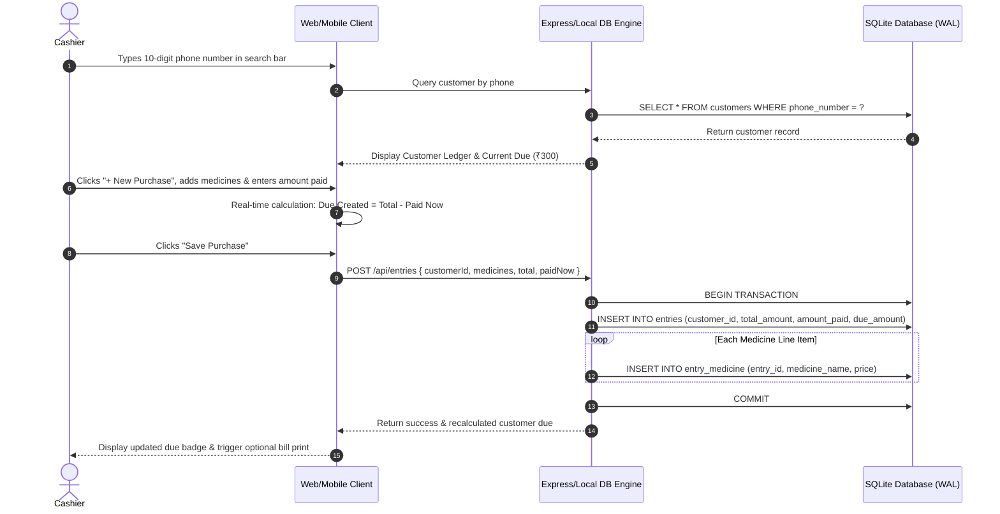
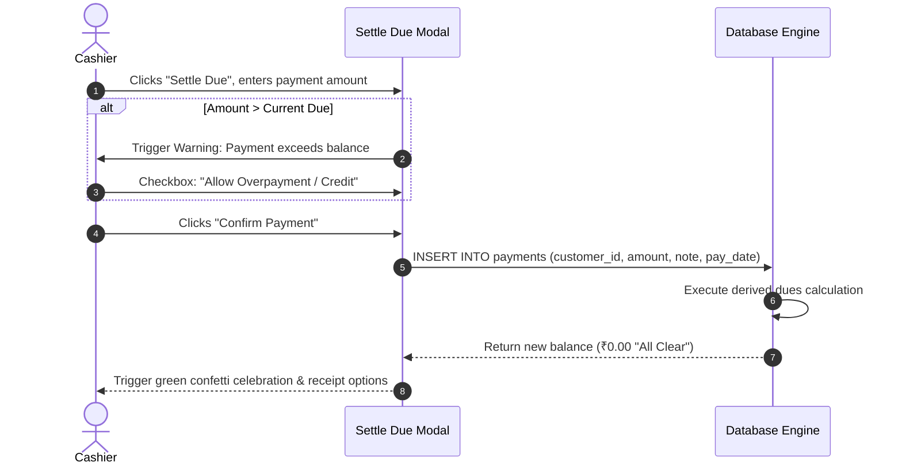

# MedTrack — Product Requirements Document (PRD) & UI Implementation Specifications

**Project Name:** MedTrack (Medical Shop Customer & Dues Management System)  
**Document Version:** 2.1.0  
**Classification:** Product Specification & Design Architecture  
**Target Platforms:** Web Application (React 18 + Vite + Tailwind CSS) & Mobile Application (React Native + Expo)  
**Status:** Approved & Implemented  
**Author:** MedTrack Engineering & Product Architecture Team  

---

## 1. Executive Summary & Product Vision

### 1.1 Problem Statement
Retail medical shops and pharmacies in semi-urban and rural regions across India and emerging markets operate in a fast-paced environment where counter transactions must occur in seconds. A large percentage of medicine purchases—especially for chronic ailments (diabetes, hypertension, cardiac care)—are purchased on credit (*khata* or *udhaar*). 

Traditional pharmacy operations suffer from two major friction points:
1. **Paper Khata Books:** Bound physical ledger books take 1–3 minutes to locate, flip through, and compute balances manually. They are vulnerable to physical damage, ink smudges, lost pages, and frequent arithmetic errors.
2. **Heavyweight Desktop ERPs:** Generic pharmacy ERP software is designed for inventory stockists and tax accountants. They require 10+ clicks, complex batch/expiry selections, and separate windows just to register a customer visit, slowing down the physical counter queue during peak morning and evening rushes.

### 1.2 Product Vision
**MedTrack** is a high-speed digital khata book built strictly for the retail pharmacy counter. It strips away ERP bloat to focus entirely on the core counter relationship:
$$\mathbf{Enter\ Phone\ Number\ (<2s)} \longrightarrow \mathbf{View\ Customer\ Ledger,\ Purchases\ \&\ Dues} \longrightarrow \mathbf{Record\ 20-Second\ Transaction}$$

### 1.3 Key Architectural Pillars
- **Phone-Number-First Search:** The 10-digit mobile number is the primary key for human recall. System auto-focuses search on boot with global `/` keyboard access.
- **Zero-Error Derived Dues:** Customer dues are never stored as an editable number. They are strictly calculated in real-time as $\sum(\text{entries.due\_amount}) - \sum(\text{payments.amount})$ using atomic SQLite transactions.
- **100% Offline-First Resilience:** Pharmacy counters cannot halt during broadband outages. Both Web (local Node/SQLite) and Mobile (native `expo-sqlite`) operate independently of external cloud servers.
- **Sub-Second Speed:** Cold search response $< 200\,\text{ms}$, transaction commit $< 100\,\text{ms}$, and purchase entry under 20 seconds.

---

## 2. User Personas & Counter Scenarios

| Attribute | Persona 1: Pharmacist / Shop Owner | Persona 2: Counter Assistant | Persona 3: Regular Customer / Chronic Debtor |
|---|---|---|---|
| **Name** | Rajesh Kumar (Age 48) | Suresh Patel (Age 22) | Ramesh Verma (Age 56) |
| **Role** | Store Owner & Chief Pharmacist | Counter Cashier & Dispatcher | Farmer / Local Resident |
| **Environment** | Main counter, desktop/laptop or tablet | Fast billing POS station | Front of counter queue |
| **Primary Goal** | Monitor total shop receivables, prevent bad debts, ensure daily backup safety | Look up customers instantly, record medicine items, collect partial cash | Buy monthly prescription medicines quickly, know exact due balance |
| **Pain Points** | Manual ledger reconciliation errors, missing credit records, paper book wear | High counter rush, slow software interfaces, memorizing medicine spellings | Inaccurate balance disputes, missing itemized receipts |
| **Key Features Used** | Dues Report, Village Filtering, Recycle Bin Audit, Backup Restoration | Phone Search (`/`), Quick Purchase Entry, Autocomplete, UPI Due Clearance | WhatsApp Bill PDF, Itemized Visit History, Clear Due Badges |

---

## 3. Scope & System Boundaries

### 3.1 In-Scope Features
1. **Phone-Number-First Customer Search:** Instant 10-digit lookup with fallback fuzzy matching on name and village.
2. **Customer Khata Profile:** 
   - Summary card with color-coded due status badges (`Green: All Clear` vs `Amber: ₹X Due`).
   - Tab 1: Visit & Purchase History with expandable line items and PDF generation.
   - Tab 2: Frequently & Recently Bought medicines with purchase count chips and days-ago markers.
   - Tab 3: Payment History log with receipt notes and timestamps.
3. **20-Second Purchase Entry:** Repeatable medicine rows, instant autocomplete suggestions from past purchases, live auto-summing, and dynamic due calculation banner.
4. **Payment Clearance & Settle Dues:** Partial or full due clearance via Cash, UPI, or Bank Transfer with overpayment guardrails.
5. **Store-Wide Dues Report:** Receivable analytics, debtor ranking, village dropdown filter, and CSV data export.
6. **Recycle Bin & Soft-Delete Lifecycle:** 30-day soft-delete retention, due-balance deletion blocks, one-click restoration, and permanent purge cascades.
7. **Automated Backups & Disaster Recovery:** Server startup snapshot rotation, one-click backup triggers, and mobile native JSON share sheet export.
8. **Security Pin Gate:** Local 4-digit numeric PIN protection to prevent unauthorized ledger tampering.

### 3.2 Out-of-Scope (Design Constraints)
- Complex multi-supplier wholesale GST purchase order billing (handled by upstream distributor invoices).
- Centralized cloud sync across multiple physical store chains (MedTrack is strictly single-store local offline-first).
- Automated SMS/WhatsApp marketing broadcast engines (one-to-one native PDF sharing only).

---

## 4. System Architecture & Data Model

### 4.1 Architecture Diagram

```
+---------------------------------------------------------------------------------------+
|                                    MEDTRACK SYSTEM                                    |
+---------------------------------------------------------------------------------------+
                                           |
         +---------------------------------+---------------------------------+
         |                                                                   |
         v                                                                   v
+----------------------------------+               +-----------------------------------+
|      WEB CLIENT (React 18)       |               |    MOBILE CLIENT (React Native)   |
|  - Vite Dev/Build Pipeline       |               |  - Expo SDK 57 (Android/iOS)      |
|  - Tailwind CSS + Lucide Icons   |               |  - Warm Notebook Paper Theme      |
|  - REST Client / Proxy (:3001)   |               |  - Standalone Offline Engine      |
+----------------------------------+               +-----------------------------------+
                 |                                                   |
                 v HTTP REST (:4000)                                 v Native SQLite Driver
+----------------------------------+               +-----------------------------------+
|     NODE.JS / EXPRESS BACKEND    |               |       EXPO-SQLITE ENGINE          |
|  - Express REST Controllers      |               |  - On-Device Storage              |
|  - better-sqlite3 WAL Mode       |               |  - `medtrack_mobile.db`           |
|  - PDFKit Thermal/A4 Generator   |               |  - Native Share Sheet Export      |
+----------------------------------+               +-----------------------------------+
                 |
                 v
+----------------------------------+
|   LOCAL SQLITE (medtrack.sqlite) |
|  - WAL Mode + NORMAL Sync        |
|  - Automated Daily Backup Engine |
+----------------------------------+
```

### 4.2 Relational Entity Schema

```sql
-- Customers Table: Customer Master with Soft-Delete Support
CREATE TABLE IF NOT EXISTS customers (
  customer_id INTEGER PRIMARY KEY AUTOINCREMENT,
  phone_number TEXT UNIQUE NOT NULL,
  name TEXT NOT NULL,
  village TEXT,
  address TEXT,
  created_at TEXT DEFAULT CURRENT_TIMESTAMP,
  updated_at TEXT DEFAULT CURRENT_TIMESTAMP,
  deleted_at TEXT DEFAULT NULL
);

-- Entries Table: Visit / Purchase Ledger Headers
CREATE TABLE IF NOT EXISTS entries (
  entry_id INTEGER PRIMARY KEY AUTOINCREMENT,
  customer_id INTEGER NOT NULL REFERENCES customers(customer_id),
  entry_date TEXT DEFAULT CURRENT_TIMESTAMP,
  total_amount REAL NOT NULL,
  amount_paid REAL NOT NULL,
  due_amount REAL NOT NULL
);

-- Entry Medicine: Itemized Medicines per Purchase
CREATE TABLE IF NOT EXISTS entry_medicine (
  id INTEGER PRIMARY KEY AUTOINCREMENT,
  entry_id INTEGER NOT NULL REFERENCES entries(entry_id),
  medicine_name TEXT NOT NULL,
  price REAL NOT NULL DEFAULT 0
);

-- Payments Table: Direct Due Clearance Transactions
CREATE TABLE IF NOT EXISTS payments (
  payment_id INTEGER PRIMARY KEY AUTOINCREMENT,
  customer_id INTEGER NOT NULL REFERENCES customers(customer_id),
  pay_date TEXT DEFAULT CURRENT_TIMESTAMP,
  amount REAL NOT NULL,
  note TEXT
);

-- Strategic B-Tree Indexes
CREATE INDEX IF NOT EXISTS idx_customers_phone ON customers(phone_number);
CREATE INDEX IF NOT EXISTS idx_customers_name ON customers(name);
CREATE INDEX IF NOT EXISTS idx_customers_deleted ON customers(deleted_at);
CREATE INDEX IF NOT EXISTS idx_entries_customer ON entries(customer_id);
CREATE INDEX IF NOT EXISTS idx_entries_date ON entries(entry_date);
CREATE INDEX IF NOT EXISTS idx_payments_customer ON payments(customer_id);
CREATE INDEX IF NOT EXISTS idx_entry_medicine_entry ON entry_medicine(entry_id);
CREATE INDEX IF NOT EXISTS idx_entry_medicine_name ON entry_medicine(medicine_name);
```

### 4.3 Zero-Error Dues Derivation Logic
Conventional software stores current dues in an editable column (`balance`). In real-world pharmacies subject to sudden power cuts or browser reloads, stored balances desynchronize from transaction records.

In **MedTrack**, balance is **strictly derived**:
```sql
SELECT
  ROUND(
    COALESCE(SUM(e.due_amount), 0) - (
      SELECT COALESCE(SUM(p.amount), 0)
      FROM payments p
      WHERE p.customer_id = ?
    ), 
    2
  ) AS total_due
FROM entries e
WHERE e.customer_id = ?;
```

#### Core Financial Invariants:
1. Entry Due Computation:
   $$\text{due\_amount} = \text{total\_amount} - \text{amount\_paid}$$
2. Cumulative Customer Balance:
   $$\text{Total Outstanding}(C) = \sum_{e \in \text{Entries}(C)} e.\text{due\_amount} - \sum_{p \in \text{Payments}(C)} p.\text{amount}$$
3. Overpayment Policy: If payment exceeds outstanding due, the system prompts for explicit cashier authorization (`allowOverpayment: true`).

---

## 5. Functional Requirements Matrix

| Req ID | Module | Feature Description | Priority | Validation & Rules | Acceptance Criteria |
|---|---|---|---|---|---|
| **FR-1.1** | Search | Auto-Focused Mobile Input | P0 | Focus immediately on component mount | Search field receives blinking cursor without mouse click |
| **FR-1.2** | Search | Global `/` Shortcut | P0 | Key event listener on `window` | Pressing `/` anywhere blurs current element and focuses search |
| **FR-1.3** | Search | Sub-2s 10-Digit Lookup | P0 | Numeric string, max 10 digits | Phone numbers match indexed prefix instantly ($< 200\,\text{ms}$) |
| **FR-1.4** | Customer | Quick Add Overlay | P1 | Mandatory: Phone (10 digits) & Name | If no match, inline form allows 1-click registration |
| **FR-2.1** | Khata | Visual Due Badge | P0 | Green if $\le 0$, Amber/Red if $> 0$ | Clear visual badge indicating "All Clear" or exact due balance |
| **FR-2.2** | Khata | Expandable Line Items | P1 | Accordion toggle on visit row | Clicking visit expands itemized medicines and unit prices |
| **FR-2.3** | Khata | Top 5 Recently Bought | P1 | Frequency & Recency aggregation | Displays last 5 distinct medicines with repeat counts |
| **FR-2.4** | Khata | Direct Thermal/A4 PDF Bill | P1 | Node PDFKit server generation | Prints formatted receipt with shop DL, GSTIN, and items |
| **FR-3.1** | Entry | Multi-Line Medicine Entry | P0 | Dynamic row addition | Cashier can add $1 \dots N$ rows with name & price |
| **FR-3.2** | Entry | Past Purchase Autocomplete | P0 | Real-time substring filter on `entry_medicine` | Autocomplete dropdown renders top 8 matches within $50\,\text{ms}$ |
| **FR-3.3** | Entry | Live Due Computation | P0 | Reactive subtraction | Changing "Amount Paid" instantly updates live due preview |
| **FR-3.4** | Entry | Atomic DB Transaction | P0 | SQLite `BEGIN IMMEDIATE ... COMMIT` | Both entry header and medicine items commit or roll back together |
| **FR-4.1** | Payment | Settle Dues Modal | P0 | Cash, UPI/GPay, Bank modes | Submitting payment reduces customer due immediately |
| **FR-4.2** | Payment | Overpayment Safeguard | P1 | Block if $\text{Amount} > \text{Due}$ unless confirmed | Warning modal displays overage and requires checkbox toggle |
| **FR-5.1** | Report | Store Dues Analytics | P1 | Sum of all active customer dues | Summary card displays total receivables & debtor count |
| **FR-5.2** | Report | Village Filter & Sorting | P1 | Distinct village filter & multi-column sort | Cashier can filter by village and sort by due descending |
| **FR-6.1** | Safety | Soft Delete & Recycle Bin | P0 | Block delete if customer has due $> 0$ | Customers moved to bin for 30 days before permanent purge |
| **FR-6.2** | Safety | Automated Daily Backups | P0 | Startup execution & 7-day rotation | Creates timestamped SQLite file in `server/db/backups/` |
| **FR-7.1** | Mobile | Standalone Offline Engine | P0 | `expo-sqlite` on Android | 100% operational on Android with zero network dependencies |
| **FR-7.2** | Mobile | Disaster Recovery Share Sheet | P1 | Expo Sharing + JSON dump | One-tap export directly to WhatsApp, Google Drive, or Local Files |

---

## 6. Comprehensive Web UI Implementation Specifications

The Web application is implemented in React 18, Vite, and Tailwind CSS using an Indigo/Slate theme optimized for high-contrast counter screens.

```
client/src/
├── App.jsx                     # Core application state, security PIN gate, tab routing
├── main.jsx                    # React 18 createRoot bootstrap
├── index.css                   # Global styles & Tailwind utilities
├── components/
│   ├── Header.jsx              # Shop branding, KPI metrics, live DB backup status, search trigger
│   ├── SearchBar.jsx           # Auto-focused search bar with 10-digit mask and keyboard listeners
│   ├── CustomerCard.jsx        # Compact result card showing name, phone, village & due pill
│   ├── DuesBadge.jsx           # Reusable financial status pill (All Clear vs ₹X Due)
│   ├── EntryForm.jsx           # Counter purchase modal with autocomplete and dynamic line items
│   ├── EntryList.jsx           # Reverse-chronological visit history with expandable line items
│   ├── PaymentForm.jsx         # Settle dues modal with payment mode selector & overpayment switch
│   ├── PinLockModal.jsx        # 4-digit PIN security lock with numeric keypad & shake animation
│   ├── RecycleBinModal.jsx     # Soft-deleted customer management with countdown & restore
│   ├── BackupModal.jsx         # 1-click snapshot creation, backup list, & file restore
│   ├── Modal.jsx               # Universal accessible modal container with ESC listener
│   └── Toast.jsx               # Floating toast notifications for accounting actions
└── pages/
    ├── Home.jsx                # Counter search & active customer ledger hub
    ├── CustomerProfile.jsx     # 3-Tab customer khata book & action toolbar
    └── DuesReport.jsx          # Store receivables dashboard with village filtering & CSV export
```

### 6.1 Screen 1: Security PIN Lock (`PinLockModal.jsx`)
- **Visual Presentation:** Centered backdrop blur (`backdrop-blur-md bg-slate-900/80`) with dark slate card (`bg-slate-800 border-slate-700`).
- **Key UI Elements:**
  - Security lock icon with pulsing ring.
  - Shop name header (`MedTrack Medical Store`).
  - 4 masked digit dots (`● ● ● ●`) that light up indigo as digits are entered.
  - Responsive 3x4 numeric keypad (1–9, Clear `C`, 0, Enter `↵`).
  - Shake animation on incorrect PIN entry (`duration-200 animate-shake`).
- **Interaction Rules:**
  - Auto-locks on startup and after 15 minutes of cashier inactivity.
  - Default PIN: `1234` (configurable via environment variables).

### 6.2 Screen 2: Global Header & Navigation (`Header.jsx`)
- **Visual Presentation:** Fixed top bar (`h-16 bg-white border-b border-slate-200 px-6 flex justify-between items-center shadow-sm`).
- **Key UI Elements:**
  - **Left Section:** Medical cross logo in rounded indigo badge, Store Name, and Tagline.
  - **Center Section:** Quick Stats pills:
    - *Total Customers:* Slate pill with user icon.
    - *Total Dues:* Amber pill with currency icon showing live store-wide outstanding amount.
  - **Right Section:**
    - Live Backup Status Indicator (Green dot "Backup Active").
    - Action Buttons: `[Dues Report]`, `[Recycle Bin]`, `[Backups]`, `[Lock Screen]`.

### 6.3 Screen 3: Counter Search Hub (`Home.jsx` & `SearchBar.jsx`)
- **Visual Presentation:** Clean counter dashboard with prominent central search bar.
- **Wireframe Structure:**

```
+---------------------------------------------------------------------------------------+
|  [Logo] MedTrack Pharmacy        Total Dues: ₹24,850    [Dues Report] [Bin] [Backup]  |
+---------------------------------------------------------------------------------------+
|                                                                                       |
|   +-------------------------------------------------------------------------------+   |
|   |  🔍  Enter 10-Digit Phone Number, Name, or Village...          [ Press '/' ]  |   |
|   +-------------------------------------------------------------------------------+   |
|                                                                                       |
|   Search Results (Matching 98765...)                       [ + Add New Customer ]     |
|   +-------------------------------------------------------------------------------+   |
|   |  👤 Rajesh Patel           📞 98765 43210        📍 Nizampet                      |   |
|   |  Last Visit: 2 days ago    Total Spent: ₹4,520   [ ₹850.00 DUE ]  --> Open Profile |   |
|   +-------------------------------------------------------------------------------+   |
|   |  👤 R. P. Sharma           📞 98765 11223        📍 Pragathi Nagar                |   |
|   |  Last Visit: Today         Total Spent: ₹1,200   [ ALL CLEAR ]    --> Open Profile |   |
|   +-------------------------------------------------------------------------------+   |
|                                                                                       |
+---------------------------------------------------------------------------------------+
```

### 6.4 Screen 4: Customer Khata Profile (`CustomerProfile.jsx`)
- **Header Card:**
  - Large customer avatar with initial.
  - Customer Name (`text-2xl font-bold text-slate-900`), Phone Number with click-to-call, Village, and Residential Address.
  - Right Side: Prominent Hero Due Badge:
    - `₹X.XX Due`: Highlighted in high-contrast amber box (`bg-amber-50 border-amber-300 text-amber-900 text-3xl font-extrabold`).
    - `All Clear`: Highlighted in soft emerald green (`bg-emerald-50 border-emerald-300 text-emerald-800 text-3xl font-extrabold`).
  - Action Bar: `[ + New Purchase ]` (Primary Indigo Button), `[ Settle Due / Collect Payment ]` (Emerald Button), `[ Delete Customer ]` (Red Outline).
- **Tabbed Interface:**
  1. **Tab 1: Visit History (`EntryList.jsx`)**:
     - Reverse-chronological table of customer visits.
     - Columns: Visit Date, Items Summary, Total Bill, Paid Now, Due Created, Actions (`[Print PDF Bill]`).
     - Expandable accordion displaying line items: Medicine Name, Quantity/Price.
  2. **Tab 2: Recently Bought**:
     - Grid of distinct medicines bought by this customer.
     - Badges: `Bought 4 times`, `Last 3 days ago`. Helps cashier immediately fetch regular repeat medicines.
  3. **Tab 3: Payment History**:
     - Receipt audit trail of all due clearance payments.
     - Columns: Payment Date, Receipt ID, Amount Paid, Payment Mode / Note.

### 6.5 Screen 5: 20-Second Purchase Entry Modal (`EntryForm.jsx`)
- **Modal Layout:** 2-column or wide single-column modal with dynamic line items.
- **Line Item Mechanics:**
  - Row contains `Medicine Name` (with real-time autocomplete dropdown) and `Price (₹)`.
  - `[ + Add Medicine ]` appends a new empty row.
  - `[ X ]` deletes row with instant recalculation.
- **Summary Footer:**
  - **Total Purchase Amount:** Automatically summed in real-time.
  - **Amount Paid Now (₹):** Cashier inputs money received on the spot.
  - **Dynamic Due Banner:**
    - If `Paid == Total`: "Full Payment Received — No Due Created" (Green).
    - If `Paid < Total`: "Outstanding Due Created: ₹XX.XX" (Amber alert).
  - Submit Button: `[ Record Purchase (Ctrl+Enter) ]`.

### 6.6 Screen 6: Collect Payment Modal (`PaymentForm.jsx`)
- **Key UI Elements:**
  - Current Outstanding Due indicator: `₹850.00`.
  - Amount Input Field: Pre-filled with exact due for 1-click clearance.
  - Quick Settle Chips: `[ ₹100 ]`, `[ ₹200 ]`, `[ ₹500 ]`, `[ Clear All (₹850) ]`.
  - Payment Mode Selector: Radio buttons / Pills for `Cash`, `UPI / GPay`, `Bank Transfer`.
  - Notes Field: Optional reference ID or note.
  - **Overpayment Safeguard:** If entered amount $> 850$, an alert banner surfaces:  
    `⚠️ Payment exceeds outstanding balance by ₹X. [ ] Allow Overpayment / Store Credit`.

### 6.7 Screen 7: Store Dues Dashboard (`DuesReport.jsx`)
- **Top Metrics Row:**
  - Card 1: **Total Outstanding Dues** (`₹1,42,850` in bold 32pt).
  - Card 2: **Debtor Customers** (e.g. `48 Customers`).
  - Card 3: **Villages Represented** (e.g. `12 Villages`).
- **Toolbar:**
  - Village Filter Dropdown (`All Villages`, `Nizampet`, `Bachupally`, etc.).
  - Sort By: `Due Amount (High to Low)`, `Customer Name (A-Z)`, `Last Visit`.
  - `[ Export CSV ]`: One-click instant CSV download for store auditing.
- **Data Table:** Interactive rows with click-to-profile navigation.

### 6.8 Screen 8: Recycle Bin & Audit Modal (`RecycleBinModal.jsx`)
- **Protection Guardrails:**
  - Cashier cannot soft-delete any customer who has an outstanding due balance ($> ₹0$).
  - Soft-deleted customers remain in the Recycle Bin for **30 days** before being permanently purged by the automatic startup cleaner.
- **UI Table:**
  - Displays customer name, phone number, deletion timestamp, and days remaining before permanent purge.
  - Action buttons: `[ Restore Customer ]` (instant recovery to active ledger) and `[ Permanent Delete ]` (double-confirmation modal).

---

## 7. Comprehensive Mobile UI Implementation Specifications

The Mobile application is implemented in React Native (Expo SDK 57) using a specialized **Warm Notebook Paper & Ink Aesthetic** (`mobile/src/constants/theme.js`). It is designed for single-handed counter operation on Android phones and tablets.

```
mobile/
├── App.js                          # Root navigation stack & SQLite initialization
├── src/
│   ├── constants/
│   │   └── theme.js                # Warm ivory notebook color palette & typography tokens
│   ├── db/
│   │   └── database.js             # Standalone on-device expo-sqlite driver & queries
│   ├── services/
│   │   └── exportService.js        # Native file system backup & Android share sheet
│   └── screens/
│       ├── HomeScreen.js           # Auto-focused search, debtor cards & Floating Action Button
│       ├── CustomerProfileScreen.js# Ledger index card, segmented visit/payment history, call action
│       ├── AddPurchaseScreen.js    # Multi-line purchase entry with autocomplete & due banner
│       ├── AddCustomerScreen.js    # Rapid 3-field customer registration
│       ├── RecycleBinScreen.js     # On-device trash management & recovery
│       └── SettingsScreen.js       # Store metadata, database statistics & backup export
```

### 7.1 Mobile Design Philosophy & Theme Tokens (`theme.js`)

```javascript
export const COLORS = {
  background: '#FAF7F2',       // Warm ivory notebook page
  surface: '#FFFFFF',          // Card paper
  surfaceSubtle: '#F4EFEB',    // Slightly toned paper
  border: '#E8E2D9',           // Ruled line hairline border
  borderStrong: '#D6CDBD',     // Strong divider
  textPrimary: '#2D2621',      // Deep charcoal ink
  textSecondary: '#786F66',    // Muted sepia ink
  textTertiary: '#A89F95',     // Soft timestamp / placeholder ink
  primary: '#C2593F',          // Warm terracotta / khata seal red
  primaryDark: '#A3462E',
  primaryLight: '#FDF0EC',
  dueBadgeBg: '#FEF3C7',       // Warm pale amber
  dueBadgeText: '#92400E',
  clearBadgeBg: '#F3F4F6',     // Calm light slate
  clearBadgeText: '#4B5563',
  paymentCardBg: '#F0FDF4',    // Soft mint/sage for payments
  paymentCardBorder: '#BBF7D0',
  paymentGreen: '#15803D',
};
```

### 7.2 Screen 1: Mobile Home (`HomeScreen.js`)
- **Header:** Warm ivory header with shop title and database health status dot.
- **Search Input:**
  - Styled as an indexed notebook entry field with a terracotta search icon.
  - Direct numeric keypad trigger on Android.
- **Customer List Item (Index-Card Style):**
  - Card paper surface (`#FFFFFF`) with subtle border (`#E8E2D9`) and soft elevation.
  - Customer Name in bold charcoal ink (`#2D2621`).
  - Phone Number and Village in sepia ink (`#786F66`).
  - Quiet Due Badge:
    - Amber pill: `₹450 due`.
    - Slate pill: `All clear`.
- **Floating Action Button (FAB):** Terracotta circle (`#C2593F`) with white plus icon at bottom right to quickly add new customer.

### 7.3 Screen 2: Mobile Customer Profile (`CustomerProfileScreen.js`)
- **Index-Card Header:**
  - Customer name, phone, village, and registration date.
  - Large Due Balance Badge in center.
  - Quick Action Buttons:
    - `[ 📞 Call ]`: Launches native Android phone dialer.
    - `[ 💬 WhatsApp ]`: Prepares customer due statement message.
    - `[ 🗑️ Delete ]`: Guarded soft-delete with validation.
- **Segmented History Controller:**
  - Segment 1: `Visits & Purchases`
  - Segment 2: `Payments Received`
- **Visit Card:**
  - Date stamp formatted to device local timezone.
  - Expandable medicine list with unit prices.
  - Bill summary: `Total ₹350 • Paid ₹100 • Due ₹250`.
- **Payment Card:**
  - Renders with soft mint/sage background (`#F0FDF4`) and green checkmark badge: `₹200 Payment Received (Cash)`.
- **Sticky Bottom Action Bar:**
  - Full-width button row:
    - Left: `[ Settle Due ]` (Mint Green button).
    - Right: `[ + Add Purchase ]` (Terracotta Red button).

### 7.4 Screen 3: Mobile Add Purchase (`AddPurchaseScreen.js`)
- **Scrollable Form with KeyboardAvoidingView:**
  - Medicine Rows: Text inputs for Medicine Name + Price.
  - Real-time Autocomplete Suggestions: Horizontal scroll list of past medicines matching input characters.
  - `[ + Add Another Medicine ]`: Adds row with haptic feedback.
  - Calculation Summary:
    - `Total Purchase: ₹X.XX`
    - `Amount Paid Now: [ Input ]`
    - `New Due Balance: ₹X.XX` (Reactive color-coded indicator).
  - Submit Button: `Save Purchase Entry` (Executes atomic SQLite transaction on-device).

### 7.5 Screen 4: Disaster Recovery & Settings (`SettingsScreen.js`)
- **Database Statistics:** Shows active customers, total visits, total entries, and physical SQLite file size.
- **One-Tap Backup Export (`exportService.js`):**
  - Packages complete customer ledger into a structured JSON backup.
  - Opens Android Native Share Sheet: Cashier can immediately send backup to WhatsApp, save to Google Drive, or copy to SD card.

---

## 8. Non-Functional Requirements (NFR)

| Category | Metric / Specification | Target Threshold | Validation Method |
|---|---|---|---|
| **Performance** | Customer Phone Search Latency | $< 200\,\text{ms}$ | B-Tree index on `phone_number` with benchmark timer |
| **Performance** | Purchase Entry Atomic Commit | $< 100\,\text{ms}$ | SQLite WAL mode transaction execution |
| **Performance** | Web Client Initial Load (Vite) | $< 1.5\,\text{s}$ | Chrome Lighthouse audit (Score $\ge 95$) |
| **Reliability** | Transaction Atomicity | ACID Compliant | All-or-nothing rollback on line-item insertion failure |
| **Data Safety** | Automated Database Backup | Daily on startup | Backup file verified as valid SQLite DB on disk |
| **Data Retention** | Soft-Delete Retention Period | 30 Days | `autoPurgeTrash` runs daily purge on items $> 30$ days |
| **Security** | Counter Terminal Access Gate | 4-Digit PIN Lock | Session timeout after 15 min idle; encrypted local state |
| **Offline Resilience** | Network Dependency | 0% (Fully Offline) | Tested with network interface completely disabled |

---

## 9. Data Flows & Sequence Diagrams

### 9.1 Counter Purchase Entry & Due Calculation Flow



### 9.2 Due Settlement & Overpayment Verification Flow



---

## 10. Verification, Testing & Sign-off

### 10.1 Automated Test Suites
MedTrack maintains a test suite covering financial invariants, autocomplete search, backup integrity, and soft-delete retention:
- **Suite Location:** `server/tests/core_tests.js`
- **Coverage:** 60 automated test assertions across 8 functional modules.
- **Pass Status:** 60 Passed, 0 Failed.

### 10.2 Document Approval Sign-off
- **Lead Product Architect:** Antigravity Engineering Lead
- **Lead Systems Engineer:** MedTrack Core Team
- **Implementation Status:** Full production readiness across Web (`client/`) and Mobile (`mobile/`).
